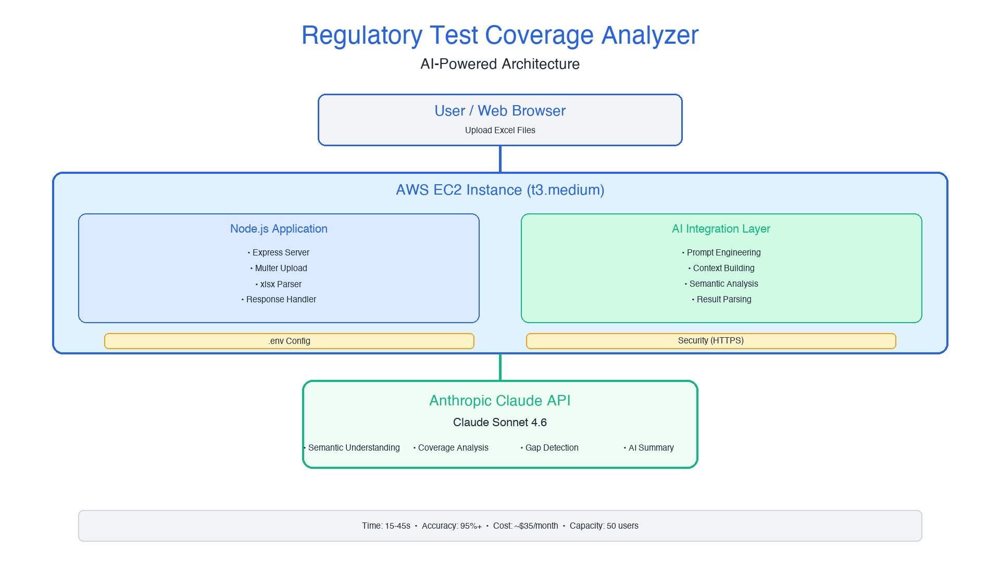

# Regulatory Test Coverage Analyzer

> AI-powered semantic analysis for regulatory compliance testing

[](https://nodejs.org/) [](https://www.anthropic.com/) [](https://aws.amazon.com/)

---

## Overview

Uses Anthropic's Claude AI to intelligently match regulatory requirements with test cases through **semantic understanding**—not keyword matching. Achieves **95%+ accuracy** in identifying coverage gaps with AI-generated insights in 15-45 seconds.



---

## Key Features

- 🧠 **AI-Powered** - Claude Sonnet 4.6 semantic analysis
- ⚡ **Fast** - Results in 15-45 seconds
- 📊 **Visual Dashboard** - Interactive coverage percentages
- 📝 **Executive Summaries** - AI-generated insights
- 🔒 **Secure** - In-memory processing, no storage
- 🚀 **AWS Ready** - Optimized for EC2

---

## Quick Start

```bash
# Install
git clone <your-repo>
cd coverage-analyzer
npm install

# Configure
cp .env.example .env
# Edit .env: Add ANTHROPIC_API_KEY

# Run
npm start
# Open http://localhost:3000
```

**Usage:** Upload Excel files → Click "Analyze Coverage" → View results

---

## Architecture

### System Flow

1. **User uploads** Excel files (questionnaire + test inventory)
2. **AWS EC2 processes** and extracts data
3. **Claude AI analyzes** with semantic understanding
4. **Results displayed** with coverage % and AI summary

### Technology Stack

- **AI**: Claude Sonnet 4.6 (semantic analysis)
- **Backend**: Node.js + Express
- **Parser**: xlsx (SheetJS)
- **Frontend**: HTML5 + CSS3 + JavaScript
- **Deployment**: PM2 on AWS EC2

---

## AWS EC2 Deployment

**Recommended:** t3.medium (2 vCPUs, 4GB RAM)

```bash
# On EC2
curl -fsSL https://deb.nodesource.com/setup_20.x | sudo -E bash -
sudo apt-get install -y nodejs
git clone <your-repo>
cd coverage-analyzer
npm install
cp .env.example .env
nano .env  # Add API key
sudo npm install -g pm2
pm2 start server.js
pm2 save
pm2 startup
```

**Cost:** ~$35/month | **Capacity:** 50 concurrent users

---

## Configuration

Get Claude API key: [console.anthropic.com](https://console.anthropic.com/)

```bash
# .env
ANTHROPIC_API_KEY=sk-ant-xxxxx
PORT=3000
```

---

## How It Works

**Traditional keyword matching** fails:
- "KYC documentation" ≠ "Know Your Customer" ❌

**Our AI understands intent**:
- "KYC documentation" = "Know Your Customer" ✅

### Processing Pipeline

```
Phase 1: Upload & Parse (1-2s)
Phase 2: AI Analysis (10-35s)
Phase 3: Visualization (0.5-1s)
Total: 15-45 seconds
```

---

## Security

- **Infrastructure**: AWS VPC, security groups, IAM
- **Application**: .env files, file validation, CORS
- **API**: HTTPS only, key authentication
- **Data**: In-memory only, no persistence

---

## API Reference

### POST /api/analyze

```bash
# Request
Content-Type: multipart/form-data
- questionnaire: Excel file
- inventory: Excel file

# Response
{
  "summary": "AI executive summary",
  "regulations": [
    {
      "regulation": "Name",
      "totalQuestions": 50,
      "coveredQuestions": 45,
      "coveragePercent": 90,
      "status": "Strong"
    }
  ]
}
```

---

## Performance

| Dataset | Time | Cost |
|---------|------|------|
| Small (50 questions) | ~10s | $0.05 |
| Medium (200 questions) | ~20s | $0.15 |
| Large (500+ questions) | ~35s | $0.30 |

---

## Project Structure

```
coverage-analyzer/
├── server.js              # Express server
├── package.json           # Dependencies
├── .env.example           # Config template
├── lib/
│   ├── claudeClient.js    # AI integration
│   └── parseExcel.js      # Excel parsing
└── public/
    ├── index.html         # UI
    ├── styles.css         # Styling
    └── app.js             # Frontend logic
```

---

## Troubleshooting

**API Key Error:**
```bash
cp .env.example .env
# Add: ANTHROPIC_API_KEY=sk-ant-xxxxx
```

**Port In Use:**
```bash
echo "PORT=3001" >> .env
```

**Module Not Found:**
```bash
npm install
```

---

## Generate Diagram

```bash
pip3 install Pillow
python3 generate-diagram.py
```

---

## License

MIT License

---

**Built for regulatory compliance teams** 🚀

*Semantic understanding, not just keyword matching*
